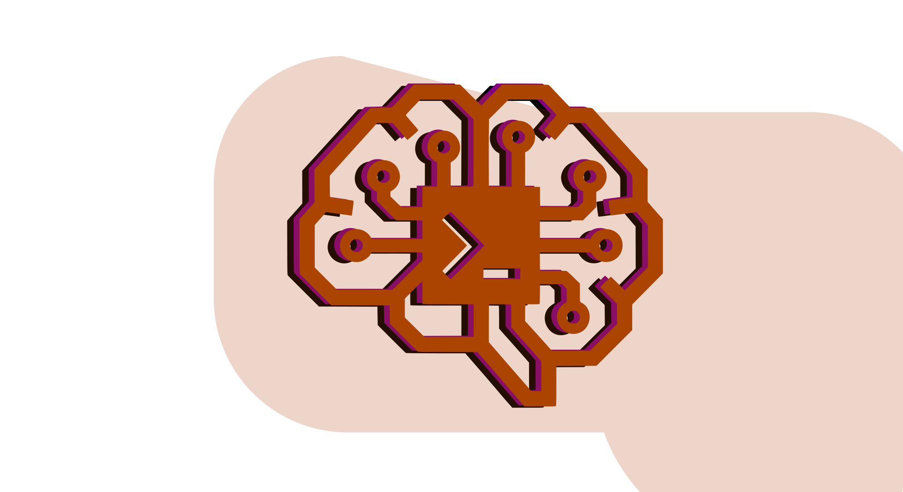
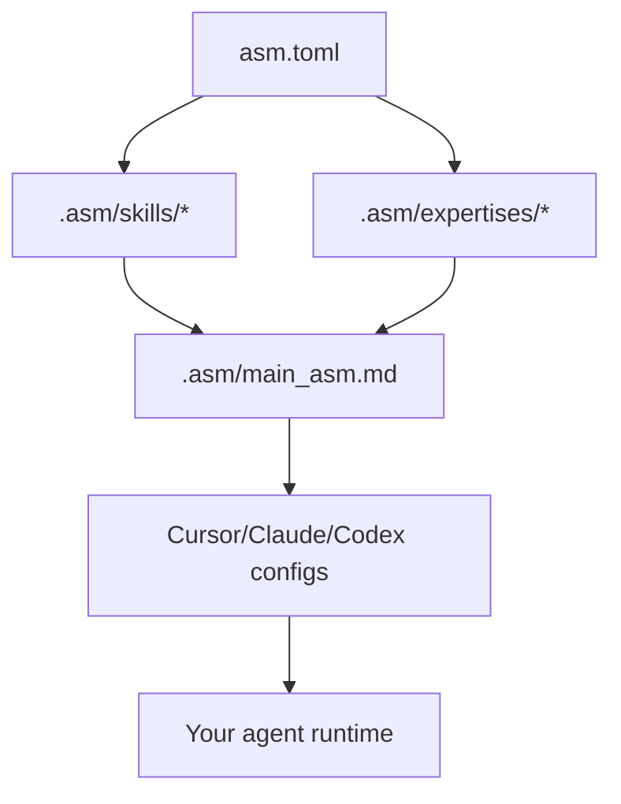

# ASM — Agent Skill Manager


<p align="center">
  
</p>

[](https://www.python.org/)
[](https://click.palletsprojects.com/)
[](https://docs.astral.sh/uv/)

ASM manages a project-local `.asm/` skill graph and syncs it into Cursor / Claude / Codex.

- **Curated Index**: Verified, high-quality skills with non-obvious knowledge and actionable patterns.
- **Expertise Layer**: Bundle skills into task-oriented domains for autonomous agent selection and auto-configuration.
- **Semantic Search**: Embedding-based lookup (via LiteLLM) with local caching for sub-second relevance.
- **Reproducible Graphs**: `asm.toml` + `asm.lock` pin exact skill sources and hashes.
- **Zero-Touch Sync**: Keeps Cursor / Claude / Codex configs in sync with your `.asm/` graph.

[Quick Start](#quick-start) · [Example workflows](#example-workflows) · [Usage](#usage) · [How skill graphs work](#how-skill-graphs-work) · [CLI map](#cli-map) · [Agent Integration](#agent-integration)

## TL;DR

- **What ASM is**: A project-local skill manager for agents that installs skills into `.asm/`, bundles them into *expertises*, and syncs a single `main_asm.md` index that your IDE agents read first.
- **Why you care**: New projects (or new machines) can get the exact same "brain" in one command (`asm sync`), instead of copy-pasting prompts and skills by hand.
- **Fast path**:
  1. `curl -LsSf https://raw.githubusercontent.com/gil-kapel/asm/main/install.sh | sh`
  2. `asm init` in your repo
  3. `asm search "<your stack or problem>"` → `asm add skill <source>`
  4. `asm expertise auto "<task description>"` → `asm sync`

## Copy Prompt For Your Agent

Use this prompt in **any** agent (Cursor, Claude Code, Codex, or other) to set up ASM in the project.

```text
Set up ASM in this project end-to-end.

ASM (Agent Skill Manager) is a project-local skill orchestrator. It installs curated agent skills into `.asm/`, builds a root index (`.asm/main_asm.md`), and syncs those skills into the active agent’s config — whether you are Cursor, Claude Code, Codex, or another agent that reads SKILL.md / CLAUDE.md / AGENTS.md.

1) Install ASM:
   curl -LsSf https://raw.githubusercontent.com/gil-kapel/asm/main/install.sh | sh

2) Initialize ASM in the current project root:
   asm init

3) (Optional) For semantic search and AI-generated skills:
   - set `SKILLSMP_API_KEY` or `OPENAI_API_KEY` in ~/.asm-cli/.env

4) Discover and install relevant skills:
   - run `asm search <query>` to find verified skills (marked [curated])
   - run `asm add skill <source>` for each selected skill
   - To create a skill from a GitHub repo: asm create skill <name> "<description>" --from-repo owner/repo --ai
   - Optional: install a skill-creator skill for guided creation: asm search "skill creator" then asm add skill <source>

5) Automate expertise for your task:
   - run `asm expertise auto "<task description>"`
   - ASM will match your task to expertise bundles, install missing skills, and sync agent context.

6) Sync into this agent’s config:
   asm sync

7) Output:
   - list installed skills and active expertises
   - confirm which agent(s) were synced (e.g. Cursor → .cursor/skills/asm, Claude Code → .claude/skills/asm + CLAUDE.md, Codex → AGENTS.md)
```

## Quick Start

```bash
# 1) Install ASM
curl -LsSf https://raw.githubusercontent.com/gil-kapel/asm/main/install.sh | sh

# 2) Initialize in your project
asm init

# 3) Find and add relevant skills
asm search "your stack or problem" --limit 5
asm add skill <source>

# 4) Route task to expertises and validate routing quality
asm expertise auto "improve expertise suggestion accuracy"
asm expertise eval --dataset ./tests/routing_benchmark.jsonl --min-top1 0.80 --min-topk 0.95

# 5) Sync into active agent context
asm sync
```

## Example workflows

### 1. Onboard into an existing repo

```bash
git clone https://github.com/your-org/your-repo.git
cd your-repo
asm sync
```

Example output:

```text
↓ sqlmodel-database (github:tiangolo/sqlmodel)… 
✔ sqlmodel-database installed (320ms)
✔ sql (no lock entry)
  ↻ synced cursor → .cursor/skills/asm/SKILL.md
✔ Synced 2 skill(s) in 0.6s
```

Now your agent sees the same skills and expertises as the rest of the team.

### 2. Discover and install a curated skill

```bash
cd ~/my-project
asm init
asm search "sqlmodel repository" --limit 3
asm add skill pb:openclaw/skills/sql
```

Example output:

```text
Found 1 result(s):
1. [playbooks] sql
   id: openclaw/skills/sql
   url: https://playbooks.com/skills/openclaw/skills/sql
   source: pb:openclaw/skills/sql
   SQL utility patterns for agents

↓ sql (pb:openclaw/skills/sql)…
✔ sql installed (410ms)
  ↻ synced cursor → .cursor/skills/asm/SKILL.md
✔ Installed skill: sql
  SQL utility patterns for agents
  → .asm/skills/sql/SKILL.md
```

### 3. Let ASM build an expertise bundle for a task

```bash
asm expertise auto "build a REST API with database migrations"
```

Example output:

```text
Matching task to expertises…
✔ Expertise: db-layer-plus
  Skills: sqlmodel-database, sql, python-testing
  → .asm/expertises/db-layer-plus/index.md
  ↻ synced cursor → .cursor/skills/asm/SKILL.md
```

Your agent now has a guided path (via the expertise docs) instead of a flat pile of skills.

## Install

```bash
curl -LsSf https://raw.githubusercontent.com/gil-kapel/asm/main/install.sh | sh
```

Or with `wget`:

```bash
wget -qO- https://raw.githubusercontent.com/gil-kapel/asm/main/install.sh | sh
```

The script detects your system, installs [uv](https://docs.astral.sh/uv/) if needed, and installs ASM from the official release wheel. No sudo required.

**Requirements:** Python 3.10+

### Manual install

If you prefer doing it yourself (same release wheel used by `install.sh`):

```bash
uv tool install --reinstall "https://github.com/gil-kapel/asm/releases/latest/download/asm-<version>-py3-none-any.whl"
```

**Note:** If the project has no releases yet, or to get the latest development version, install from source:

```bash
uv tool install git+https://github.com/gil-kapel/asm
```

### Local Development

If you are developing ASM locally:

```bash
uv tool install --editable .
```

Verify:

```bash
asm --version
```

### Update ASM

To update to the latest version from source:

```bash
uv tool upgrade asm --from git+https://github.com/gil-kapel/asm
```

Or just use the built-in update:

```bash
asm update
```

`asm update` is resilient: it tries to update from the official release wheel first, and falls back to the source (git) if no valid release is found.

### Uninstall

```bash
uv tool uninstall asm && rm -rf ~/.asm-cli
```

## Releases & Changelog

- **Versioning**: ASM follows semantic versioning (`MAJOR.MINOR.PATCH`), with the canonical version defined in `pyproject.toml`.
- **Changelog**: All notable changes are recorded in `CHANGELOG.md` (Keep a Changelog format).
- **Release flow** (manual, via Git tags and GitHub releases):
  1. Update the version in `pyproject.toml`.
  2. Update `CHANGELOG.md`, moving entries from **Unreleased** into a new version section.
  3. Commit changes and create a tag, e.g. `git tag v0.1.0`.
  4. Build wheels with `uv build` and attach them to a GitHub release for that tag.

## Usage

### Initialise a workspace

```bash
cd ~/my-project
asm init
```

This creates:

```
my-project/
├── asm.toml           # Project config & skill registry
└── .asm/
    ├── main_asm.md    # Root index — agents read this first
    └── skills/        # Installed skill packages
```

### Add a skill from GitHub

```bash
# Full URL
asm add skill https://github.com/github/awesome-copilot/tree/main/skills/refactor

# Shorthand
asm add skill github/awesome-copilot/skills/refactor

# Override the name
asm add skill user/repo/path --name my-refactor
```

ASM clones the skill, validates its `SKILL.md`, installs it under `.asm/skills/`, and updates `asm.toml` + `asm.lock`.

Important: `asm add skill` requires a source reference, not a skill name.

```bash
# Invalid (skill name only)
asm add skill sql

# Valid (provider ref or URL)
asm add skill pb:openclaw/skills/sql
asm add skill https://playbooks.com/skills/openclaw/skills/sql

# If already declared in asm.toml, install all missing declared skills
asm sync
```

### Add a local skill

```bash
asm add skill ./path/to/my-skill
asm add skill local:../shared-skills/testing
```

### Search curated and federated registries

```bash
# Search across curated index and healthy providers
asm search "database patterns"

# Limit result size
asm search "frontend design" --limit 5
```

ASM performs federated discovery across available providers (ASM index, Smithery, Playbooks, GitHub, SkillsMP).
- **[curated]**: Verified skills with quality scoring rank first.
- **Semantic Ranking**: Query embeddings (via LiteLLM) are matched against skill triggers for high relevance.
- **Local Cache**: Embeddings are cached in `~/.asm-cli/embeddings.msgpack` for instant search.

### Add from Smithery / Playbooks links

```bash
# Direct provider URLs are supported
asm add skill "https://smithery.ai/skill/mjunaidca/sqlmodel-database"
asm add skill "https://playbooks.com/skills/openclaw/skills/sql"

# Provider refs are also supported
asm add skill "sm:mjunaidca/sqlmodel-database"
asm add skill "pb:openclaw/skills/sql"
```

### Configure SkillsMP API key

SkillsMP access is optional. If you want SkillsMP-backed discovery, create your own API key and expose it as an environment variable.

1. Log in to https://skillsmp.com
2. Open **Settings** (or **Developer / API Keys**)
3. Click **Create API Key**
4. Name the key (for example: `asm-local-dev`)
5. Copy the key and store it in a **user-level** env file (works across all projects)

```bash
mkdir -p ~/.asm-cli
cat >> ~/.asm-cli/.env <<'EOF'
SKILLSMP_API_KEY=sk_live_skillsmp_...
EOF
```

ASM automatically reads user-level env files on startup (without overriding already-exported shell variables):

- `~/.asm-cli/.env`
- `~/.config/asm/env`
- `~/.config/asm/.env`

Recommended placement: `~/.asm-cli/.env` (avoid project `.env` files so keys are not committed by mistake).

If you prefer shell profile exports, this also works:

```bash
echo 'export SKILLSMP_API_KEY=sk_live_skillsmp_...' >> ~/.zshrc
```


### Create a skill from scratch

```bash
asm create skill api-patterns "REST API design patterns for FastAPI services"
```

Scaffolds a new skill package:

```
.asm/skills/api-patterns/
├── SKILL.md       # Frontmatter + instructions for the agent
├── scripts/       # Executable code for deterministic tasks
└── references/    # Docs loaded into agent context as needed
```

### Expertise: Autonomous Skill Bundling

Expertises group multiple skills into task-oriented domains. Agents can autonomously match your natural language task to the right expertise.

```bash
# 1) Create a bundle of installed skills
asm create expertise routing-quality-engineering routing-evals embedding-ops python-testing \
  --desc "Deterministic expertise-routing quality with embedding diagnostics and regression gates"

# 2) Match a task to existing expertises (sub-second similarity check)
asm expertise suggest "debug embedding similarity mismatches in expertise ranking"

# 3) Full autonomous flow: match or create, install missing, and sync
asm expertise auto "improve expertise suggestion accuracy"

# 4) Evaluate routing quality against a benchmark dataset
asm expertise eval --dataset ./tests/routing_benchmark.jsonl --top-k 3 --min-top1 0.80 --min-topk 0.95
```

### Advanced Skill Creation (Deep Repo Analysis)

Instead of manual writing, ASM can distill complex patterns from entire GitHub repositories or local directories using AI.

```bash
# Create a skill from a GitHub repo (README, source files, and structure)
asm create skill sqlmodel-patterns "Async SQLModel usage" --from-repo tiangolo/sqlmodel

# Create from a local module
asm create skill auth-utils "Project auth conventions" --from ./src/auth/ --ai
```

- **`--from-repo OWNER/REPO`**: Fetches the README, directory structure, and key source files via GitHub API as context for the LLM.
- **`--ai`**: Use LiteLLM to generate sophisticated instructions, usage guidelines, and examples.
- **`--from ./path`**: Analyzes local code to extract internal patterns and conventions.

### AI-assisted skill creation (LiteLLM)

ASM can generate SKILL.md content (Instructions, Usage, Examples) using an LLM via [LiteLLM](https://github.com/BerriAI/litellm). Install the optional extra and set a provider API key:

```bash
uv tool install asm   # or: pip install asm
export OPENAI_API_KEY=sk-...   # or ANTHROPIC_API_KEY, etc.
```

Create a skill with generated content:

```bash
asm create skill pdf-helper "Extract text and tables from PDFs" --ai
asm create skill cli-ux "CLI UX patterns for Click" --ai --model anthropic/claude-3-5-sonnet
```

- **`--ai`**: Use LiteLLM to generate the skill description and body.
- **`--model`**: LiteLLM model string (default: `openai/gpt-4o-mini`). Can be set with `ASM_LLM_MODEL`.
- **`--from ./path`**: Local file or directory; the LLM receives its content as context.
- **`--from-url URL`**: Fetch content from a URL and use it as context for the LLM. Supports GitHub API contents (e.g. `https://api.github.com/repos/owner/repo/contents/README.md?ref=main`) and raw URLs; directories are expanded by fetching each file.

LiteLLM supports 100+ providers (OpenAI, Anthropic, Gemini, Bedrock, etc.) with a single interface; set the corresponding API key and use the `provider/model-name` format for `--model`.

### Create a skill from existing code

```bash
asm create skill db-layer "Async SQLAlchemy repository pattern" --from ./src/database.py
```

Source files are analysed and placed into `scripts/` (`.py`, `.sh`) or `references/` (everything else).

### Sync workspace

```bash
asm sync
```

Like `uv sync` — reads `asm.toml` and reconciles your `.asm/skills/` directory:

- **Missing skills** are fetched from their declared source (GitHub / local)
- **Existing skills** are verified against their `asm.lock` integrity hash
- **Stale lockfile entries** (removed from `asm.toml`) are pruned
- After installing, `main_asm.md` is regenerated and agent configs are synced

This is the team onboarding command:

```bash
git clone <repo> && cd <repo> && asm sync
```

### Team registry versioning flow

Use this flow when your team imports a base skill, customizes it locally, and manages versions in your own registry.

```bash
# 1) Import from upstream registry/source
asm add skill https://github.com/github/awesome-copilot/tree/main/skills/refactor

# 2) Edit the local working tree
$EDITOR .asm/skills/refactor/SKILL.md

# 3) Save WIP without creating a new local revision
asm skill stash push refactor -m "wip: adjust prompts for team style"

# 4) Restore WIP later
asm skill stash apply refactor

# 5) Create a local version revision
asm skill commit refactor -m "team: add stricter refactor checklist"

# 6) Add a human tag for release workflows
asm skill tag refactor team-v1

# 7) Roll backward/forward by tag or snapshot id
asm skill checkout refactor team-v1
asm skill checkout refactor <snapshot_id>

# 8) Inspect version timeline
asm skill history refactor
```

### Single-user local registry flow

Use this when one developer manages personal variants in a local filesystem registry/workspace.

```bash
# 1) Create/import your base skill
asm create skill prompt-tuning "Personal prompt refinement patterns"
# or: asm add skill ./my-local-skill

# 2) Iterate locally
$EDITOR .asm/skills/prompt-tuning/SKILL.md

# 3) Save temporary experiments
asm skill stash push prompt-tuning -m "wip: experiment with shorter instructions"

# 4) Commit a personal version
asm skill commit prompt-tuning -m "me: stable concise prompt style"

# 5) Tag your own milestones
asm skill tag prompt-tuning me-v1

# 6) Jump between known-good versions
asm skill checkout prompt-tuning me-v1
asm skill history prompt-tuning
```

Version model used by ASM lock entries:
- `upstream_version`: version coming from the imported/origin skill.
- `local_revision`: monotonic team/user revision in your registry.
- `registry`/`registry_id`: where ownership of the local evolution lives.
- `origin_registry`/`origin_ref`: immutable provenance of the first import.

If your repo has older lockfiles, run migration once:

```bash
asm lock migrate
```

## Agent Integration

ASM skills live in `.asm/`, but each IDE agent reads its own config location. Agent configs are synced automatically after every `asm add skill`, `asm create skill`, and `asm sync`.

### What gets generated

| Agent | File(s) | Behaviour |
|---|---|---|
| Cursor | `.cursor/skills/asm/SKILL.md` | Router skill pointing to `.asm/main_asm.md` |
| Claude Code | `CLAUDE.md` + `.claude/skills/asm/SKILL.md` | Sentinel in CLAUDE.md; router skill in `.claude/skills/` for Claude Code discovery |
| Codex | `AGENTS.md` | Sentinel-guarded section (preserves your content) |

### Context-aware sync vs explicit config

ASM chooses sync targets in this priority:

1. Explicit `[agents]` config in `asm.toml`
2. Runtime context inference (Cursor/Claude/Codex session signals)
3. Project marker detection (`.cursor/`, `CLAUDE.md`, `AGENTS.md`)
4. Fallback to Cursor (creates `.cursor/skills/asm/SKILL.md` if needed)

You can force a one-off runtime context with:

```bash
ASM_AGENT=cursor asm sync
ASM_AGENT=claude asm sync
ASM_AGENT=codex asm sync
```

To lock it down, add an `[agents]` table to `asm.toml`:

```toml
[agents]
cursor = true
claude = true
codex = false
```

When `[agents]` is configured, only those set to `true` are synced.

## How skill graphs work

```
asm.toml          Declares which skills are active + their sources
asm.lock          Pins SHA-256 integrity hashes for reproducibility
.asm/main_asm.md  Root document — agents read this first
.asm/skills/      Each skill is a self-contained SKILL.md package
```

When an agent starts a task, it reads `.asm/main_asm.md`, which lists every installed skill and points to its `SKILL.md`. The agent follows the blueprints, templates, and pitfall warnings defined in each skill — producing code that matches curated expertise instead of generic completions.

High-level flow:



- **Skills** live under `.asm/skills/*/SKILL.md` and hold reusable blueprints.
- **Expertises** (`.asm/expertises/*`) wire multiple skills together for a domain.
- **`main_asm.md`** is the single entrypoint agents read to discover what they can do.

### Skill anatomy

Every skill follows the canonical `SKILL.md` format:

```
my-skill/
├── SKILL.md          # Required — YAML frontmatter (name, description) + body
├── scripts/          # Optional — runnable code
├── references/       # Optional — context docs
└── assets/           # Optional — output files
```

The `SKILL.md` frontmatter is validated on install:

```yaml
---
name: my-skill
description: One-line explanation used for agent triggering
---
```

`name` must be kebab-case. Both `name` and `description` are required.

### The sync lifecycle

```
asm.toml ──► asm sync ──► .asm/skills/       (fetch missing)
                      ──► asm.lock           (verify / update hashes)
                      ──► main_asm.md        (regenerate index)
                      ──► agent configs      (Cursor / Claude / Codex)
```

## CLI map

- **Workspace bootstrap**: `asm init`, `asm sync`, `asm lock migrate`
- **Skill lifecycle**: `asm search`, `asm add skill`, `asm skill list`, `asm create skill`, `asm skill …`
- **Expertise & routing**: `asm create expertise`, `asm expertise list`, `asm expertise skills`, `asm expertise suggest`, `asm expertise auto`, `asm expertise eval`
- **ASM itself**: `asm update`, `asm --version`

### Full CLI reference

| Command | Description |
|---|---|
| `asm init` | Initialise workspace (`asm.toml` + `.asm/`) |
| `asm search <query>` | Federated discovery across healthy registries/providers |
| `asm add skill <source>` | Install a skill from GitHub or local path |
| `asm skill list` | List skills registered in the workspace |
| `asm create skill <name> <desc>` | Scaffold a new skill package |
| `asm create skill <name> <desc> --from <path>` | Create a skill from existing code |
| `asm sync` | Install missing skills, verify integrity, sync agent configs |
| `asm update` | Update ASM CLI in place (no manual uninstall required) |
| `asm skill commit <name> -m <msg>` | Create a new local skill revision |
| `asm skill stash push <name> [-m <msg>]` | Save WIP snapshot without version bump |
| `asm skill stash apply <name> [stash_id]` | Restore a stashed snapshot |
| `asm skill tag <name> <tag> [ref]` | Assign a tag to HEAD or a snapshot ref |
| `asm skill checkout <name> <ref>` | Materialize a tagged/snapshotted version |
| `asm skill history <name>` | Show recent version history for a skill |
| `asm skill status <name>` | Show unstaged file status vs locked snapshot |
| `asm skill diff <name> [rel_path]` | Show unified diff vs locked snapshot |
| `asm lock migrate` | Upgrade `asm.lock` schema in place |
| `asm create expertise <name> <skills...>` | Bundle skills into a task-oriented domain |
| `asm expertise list` | List expertises defined in the workspace |
| `asm expertise skills <name>` | List skills in an expertise |
| `asm expertise suggest <task>` | Match a task to existing expertises (semantic) |
| `asm expertise auto <task>` | Autonomous match/create and configuration |
| `asm expertise eval --dataset <file>` | Evaluate routing quality (top-1/top-k/MRR) and enforce gates |
| `asm --version` | Print version |

## CLI Reference

| Command | Description |
|---|---|
| `asm init` | Initialise workspace (`asm.toml` + `.asm/`) |
| `asm search <query>` | Federated discovery across healthy registries/providers |
| `asm add skill <source>` | Install a skill from GitHub or local path |
| `asm skill list` | List skills registered in the workspace |
| `asm create skill <name> <desc>` | Scaffold a new skill package |
| `asm create skill <name> <desc> --from <path>` | Create a skill from existing code |
| `asm sync` | Install missing skills, verify integrity, sync agent configs |
| `asm update` | Update ASM CLI in place (no manual uninstall required) |
| `asm skill commit <name> -m <msg>` | Create a new local skill revision |
| `asm skill stash push <name> [-m <msg>]` | Save WIP snapshot without version bump |
| `asm skill stash apply <name> [stash_id]` | Restore a stashed snapshot |
| `asm skill tag <name> <tag> [ref]` | Assign a tag to HEAD or a snapshot ref |
| `asm skill checkout <name> <ref>` | Materialize a tagged/snapshotted version |
| `asm skill history <name>` | Show recent version history for a skill |
| `asm skill status <name>` | Show unstaged file status vs locked snapshot |
| `asm skill diff <name> [rel_path]` | Show unified diff vs locked snapshot |
| `asm lock migrate` | Upgrade `asm.lock` schema in place |
| `asm create expertise <name> <skills...>` | Bundle skills into a task-oriented domain |
| `asm expertise list` | List expertises defined in the workspace |
| `asm expertise skills <name>` | List skills in an expertise |
| `asm expertise suggest <task>` | Match a task to existing expertises (semantic) |
| `asm expertise auto <task>` | Autonomous match/create and configuration |
| `asm expertise eval --dataset <file>` | Evaluate routing quality (top-1/top-k/MRR) and enforce gates |
| `asm --version` | Print version |

## Development

```bash
git clone https://github.com/gil-kapel/asm.git
cd asm
uv sync
uv run asm --version
```

Build release wheel artifacts:

```bash
./scripts/build-wheel.sh
```

This generates:
- `dist/release/asm-<version>-py3-none-any.whl` (versioned artifact)
- `dist/release/asm-py3-none-any.whl` (stable release asset name used by installer/update)

**Docs & GitHub Pages**

- Local: `uv sync --extra docs && uv run mkdocs serve` → http://127.0.0.1:8000
- Publish to GitHub Pages: push to `main` runs [`.github/workflows/deploy-docs.yml`](.github/workflows/deploy-docs.yml) and deploys the built site. **One-time:** Repo → **Settings** → **Pages** → **Build and deployment** → Source: **GitHub Actions**. Site URL: `https://<user>.github.io/asm/` (or your custom domain if set in Pages settings).

The CLI entry point is `src/asm/cli/__init__.py`, registered as `asm` via `pyproject.toml`:

```toml
[project.scripts]
asm = "asm.cli:cli"
```
