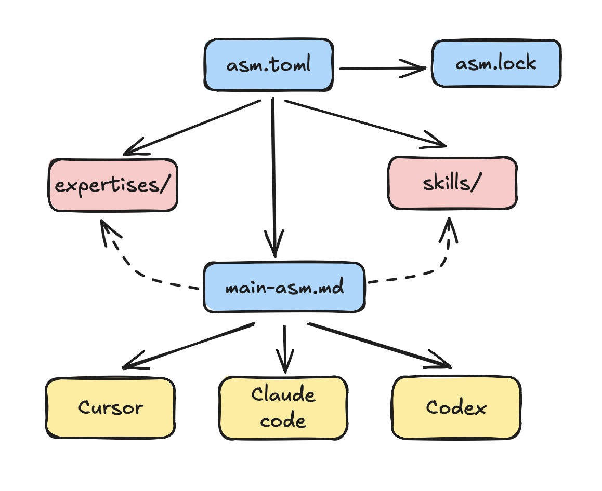

# ASM — Agent Skill Manager

**ASM is a project-local Agent Skill Manager:** it installs curated skills into `.asm/`, bundles them into task-oriented expertises, builds a root index (`.asm/main_asm.md`), and syncs into your active agent configs (Cursor, Claude, Codex, GitHub Copilot).

## Prompt for agents

Copy this into your agent (Cursor, Claude Code, Codex, GitHub Copilot) to set up ASM end-to-end:

```text
Set up ASM in this project end-to-end.

ASM CLI (Agent Skill Manager) is a project-local skill orchestrator: it installs curated agent skills into `.asm/`, builds a root index (`.asm/main_asm.md`), and syncs those skills into the active agent config (Cursor / Claude / Codex / GitHub Copilot).

1) Install ASM:
   curl -LsSf https://raw.githubusercontent.com/gil-kapel/asm/main/install.sh | sh

2) Initialize ASM in the current project root:
   asm init

3) (Optional) Configure SkillsMP/LLM access at user level:
   - set `SKILLSMP_API_KEY` or `OPENAI_API_KEY` in ~/.asm-cli/.env for semantic discovery and AI skill creation.

4) Discover and install the most relevant curated skills:
   - run `asm search <query>` to find verified skills (marked [curated])
   - run `asm add skill <source>` for each selected skill

5) Automate expertise configuration for your task:
   - describe what you want to do in natural language
   - run `asm expertise auto "<task description>"`
   - ASM will autonomously match your task to expertise bundles, install missing skills, and sync your agent context.

6) Sync integrations:
   asm sync

7) Output:
   - list installed skills and active expertises
   - confirm which agent(s) were synced (e.g. Cursor → .cursor/skills/asm, Claude Code → .claude/skills/asm, Codex → AGENTS.md, GitHub Copilot → .github/skills/asm)
```

## How it fits together



- **asm.toml** declares which skills are active and their sources; **asm.lock** pins integrity hashes.
- **.asm/expertises/** defines task-oriented bundles; **.asm/main_asm.md** is the root index agents read first; **.asm/skills/** holds each skill package.
- Agents **route by expertise first** (choose one group from `main_asm.md`), then load that group’s skills.
- **Sync** (e.g. `asm sync`) updates the workspace and agent configs from config.

## What you can do here

| Goal | Where to go |
|------|-------------|
| Get up and running quickly | [Getting started](getting-started.md) |
| Configure expertises and route by task | [Expertises](expertises.md) |
| See every command and option | [CLI reference](cli.md) |
| Author or bundle skills | [Authoring skills](skills/authoring.md) |
| See what changed by version | [Release notes](releases/index.md) |

## Quick path to “it works”

1. **Install:** `curl -LsSf …/install.sh | sh` or `uv tool install …`
2. **Initialise:** `asm init` in your project root.
3. **Add skills:** `asm search "<query>"` then `asm add skill <source>`.
4. **Match task to an expertise:** `asm expertise auto "<task description>"` so agents know which skills to use.
5. **Sync:** `asm sync` to install missing skills and update agent configs.

For the full pitch and more examples, see the [README on GitHub](https://github.com/gil-kapel/asm).
